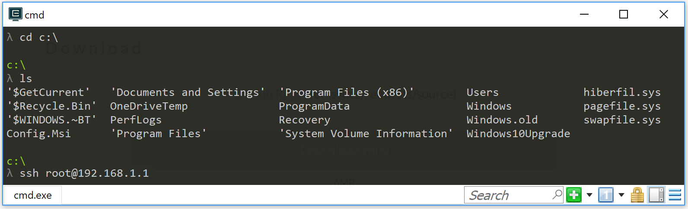

Setup
=====

Once you have a brand new installed LEDE device, the first step is to gain access to it. Depending on the image you used, it may or not have Web Interface.

 * If you used a released image, they come with LuCi by default (the web interface).
 * If you used a development image, they don't come with LuCi, so please proceed to gaining access through SSH.

After gaining access, we will setup the basics for having internet access and WiFi.

Accessing the LEDE web admin GUI
--------------------------------

LEDE has a web admin GUI called "LuCi".

  * If your LEDE device has been configured as a router or gateway with default settings, LuCi is listening on your local IP subnet's default gateway address http://192.168.1.1.
  * If your LEDE device has been configured as WiFi access point, network client or switch, LuCi's address depends on the IP address you have manually configured for your LEDE device. You can also try, to use a local network scanner or your regular router's status page to find out the device IP address.

You need to use the "root" password to successfully access LuCi, 'root' is the default admin account of your LEDE device. On a freshly installed LEDE device, there is no password set yet for the 'root' account, you can just enter right away.

Go to the System->Administration page and define a new password in both fields, then click Save and Apply (at the bottom of the page).

If you are unable to access your LEDE device, due to messed up IP address/root password configuration, refer to the troubleshooting section of the :doc:`User Guide </user-guide/index>`, to reset the LEDE device's settings.

This has verified that you can successfully use the LAN ports of your LEDE device. You now have a working LEDE device in its initial default configuration.

Troubleshooting
'''''''''''''''

For this check only use an Ethernet cable, as WiFi is by default only enabled for devices that do not have Ethernet ports

If you have flashed a development/snapshot firmware of LEDE, you first need to manually enable the admin web GUI: :doc:`development installation guide <developmentinstallation>`. Or verify the result on snapshot builds by SSH-connecting to your LEDE device IP 192.168.1.1

You can consult the troubleshooting section of the :doc:`User Guide </user-guide/start>`, if you think that resetting LEDE's settings might help.

You can consult the `Installing and Using LEDE forum section <https://forum.lede-project.org/c/installation>`_, if something went wrong. Please provide specific details of your device and what you did so far and what you have attempted to fix it.

Do not worry, if the 5 GHz WiFi does not seem to start immediately after having enabled it. It might be busy for 1-10 min scanning for weather radar, see :doc:`basic WiFi setup <basic-wifi>` for more background info.

Note that you can always run ''logread'' on the SSH command line, to gain more insight into what the device is currently doing or to diagnose any kind of problems.

If needed, you can also take a look at :doc:`Troubleshooting Internet Connectivity <ts-internetconnectivity>`.

If you have flashed a development/snapshot firmware of LEDE, you first need to manually enable the admin web GUI: :doc:`development installation guide <developmentinstallation>`. Or verify the result by SSH-connecting to your LEDE device IP 192.168.1.1

The router may have succeeded, but gotten a different IP address than you expected. Either scan your local network, check your regular router's status page (to find out about the IP address it has assigned to your LEDE device) or use :doc:`failsafe mode </user-guide/failsafe_and_factory_reset>`, to manually reset LEDE's settings (which includes the network settings)

If you have checkmarked the "Keep settings" checkbox in the previous section and the system fails to boot after flashing, you need to consult the :doc:`failsafe mode </user-guide/failsafe_and_factory_reset>`, to manually reset all settings.

SSH Access for Newcomers
------------------------

A LEDE device
  * always has SSH command line access (on port 22)
  * may also have a web admin GUI (on http port 80, and if enabled also on https port 443)

To "ssh into your router", you enter the command ''ssh root@192.168.1.1'' in a terminal emulator (for a router whose address is 192.168.1.1). The first time you ssh into your router, you will probably see a warning about the //RSA key fingerprint//. If you are certain this is the address of your LEDE router, simply type ''yes'' and press Return. Then enter the password you have given to your router, or press Return if this is the initial setup. Here is an example session::

   $ ssh root@192.168.1.1                                                         <== You type this
   The authenticity of host '192.168.1.1 (192.168.1.1)' can't be established.
   RSA key fingerprint is SHA256:4VbDA/MOc7inPiyllF5f0r3Q6iEx89ddKdhLGBovsiY.
   Are you sure you want to continue connecting (yes/no)? yes                     <== and this
   Warning: Permanently added '192.168.1.1' (RSA) to the list of known hosts.
   root@192.168.1.1's password:                                                   <== and the password here

   BusyBox v1.25.1 () built-in shell (ash)
        _________
       /        /\      _    ___ ___  ___
      /  LE    /  \    | |  | __|   \| __|
     /    DE  /    \   | |__| _|| |) | _|
    /________/  LE  \  |____|___|___/|___|                      lede-project.org
    \        \   DE /
     \    LE  \    /  -----------------------------------------------------------
      \  DE    \  /    Reboot (17.01.2, r3435-65eec8bd5f)
       \________\/    -----------------------------------------------------------

   root@LEDE:~#                                                                   <== type next command here

To end your //ssh session// to your router, type ''exit'' and press Return.

The remainder of this page describes several terminal emulators that Windows, Linux, or macOS can use to access your LEDE router.

Windows Terminal Emulators
''''''''''''''''''''''''''

Cmder, Smartty, Putty, and WinSCP are terminal emulators that allow you to ssh into a router.

Using Cmder
'''''''''''

**Cmder for Windows** is an open-source terminal emulator that runs on Windows. It is free to use and provides an easy "command line shell" that allows you to ssh into LEDE. Its attractive fonts and color scheme are easy on the eyes. The //Full// distribution is preferred (over the //mini// distribution), since it provides a bash emulation, with a Unix-y suite of commands.
  - Download cmder from http://cmder.net/
  - Unzip the `cmder.zip` file
  - Open the Cmder folder, and double-click the |cmdericon| Cmder icon. You'll see a Cmder window open similar to the image below.
  - To ssh into the LEDE router at 192.168.1.1, type ''ssh root@192.168.1.1'' then press Return

Using Smartty
'''''''''''''

Smartty gives you command line access to LEDE and allows you to open/edit/download/upload files in LEDE, and is overall more modern and user-friendly than Putty (another tool detailed below):

  - Download Smartty from http://smartty.sysprogs.com/: choose "download" for the installer, or "portable version" if you want it as a standalone program that works without installation.
  - after installation or after unzipping the archive, doubleclick on **SmarTTY** executable file.
  - You will be greeted by a window with two choices, doubleclick on "setup a new SSH connection" (the other option is for serial connections, for usb-TTL dongles and somesuch you connect to the device's debug serial pins on the board, we won't use that now).
  - The window changes into the SSH setup, write the following info:
    - **Host name:** LEDE device IP address (default is **192.168.1.1** )
    - **User Name:** **root** (this is the "administrator" and only user in default LEDE)
    - **Password:** leave this blank for your first connection, then write the password you set up (either in Luci GUI or after your first SSH access)
  - Click "Connect" button at the bottom, and you will now see a big terminal screen coming up
  - A default LEDE firmware lacks the server component to allow you to open/edit/view/upoad/download files in Smartty, so after you have connected to the internet write  ''opkg update && opkg install openssh-sftp-server'' to install it. If the next step fails, it might be necessary to reboot the LEDE device for this new service to start up properly.
  - Now you can click on **File -> Open a Remote File** to open a popup that shows the filesystem of the LEDE device, and you can navigate in it and open text files for example as normal (they will open in a SmarTTY text editor window)
  - If you want to upload or download files to/from a specific folder in the device, you can click on SCP menu and choose the most appropriate action from there.

After the first time you connected to a device, Smartty saved a profile, so you can connect again to the same device (at that IP address with that password) by just doubleclicking its icon on the first window you see when starting Smartty. You can right-click on this profile icon to edit it again, if needed.

Using putty
'''''''''''

Putty gives you command line access to LEDE:
  - Download Putty from http://www.putty.org: Simply get the 32bit ''putty.exe'' download from the ''Alternative binary files'' section.
  - Start ''putty.exe'' on your Windows client -> Putty's login window pops up.
  - go to the''Session'' category of Putty's login window, look for the field ''Host Name (or IP address)'' and simply enter the IP-address (e.g. **192.168.1.1**) of your LEDE device, keep the default provided port **22**.
  - Click the ''Open'' button at the Bottom to open a connection. This will pop up a shell windows, asking to ''login as''. Login as **root** with the LEDE password you have defined some time before. If you have not yet set a password yet on "root", you will not be asked for the password.
  - Done, you are logged into the LEDE command line.

Using WinSCP
''''''''''''

WinSCP allows you to browse the LEDE file system in Windows Exlorer like GUI-style:
  - You have to install the SFTP server on the LEDE side first, as WinSCP needs that to connect successfully. On the putty command line (see previous section) execute:

    - ''opkg update''
    - ''opkg install openssh-sftp-server''
    - It usually is not required at this point, but for the sake of simplicity of this howto, reboot your LEDE device now, to make sure the SFTP service really starts up

  - Download WinSCP from https://winscp.net/eng/download.php, get the non-beta ''Installation package'' or ''portable executables'' and install or unzip them on your Windows client
  - Start ''WinSCP.exe'' on your Windows client, WinSCP's login window will pop up
  - Click on ''New Site'' on the left, then enter your LEDE device IP address (192.168.1.1) on the right side into ''Host name'', keep the default port ''22''. In ''User name'' enter **root**, in ''Password'', enter your root **password** (or leave blank, if you have not set a password yet)
  - Click the ''Login'' at the bottom of the Window.
  - Done. You now have an Exlorer-like view of your LEDE filesystem.

**Editing LEDE config files with WINSCP's integrated GUI editor:**\\
To edit a LEDE config file with WinSCP's GUI-based editor, just right-click the file in WinSCP and select ''Edit'' from the context menu.

Linux Terminal Emulators
''''''''''''''''''''''''

All Linux distributions provide a command-line ssh client as part of the default installation.

  - Open a terminal emulator and write `ssh root@192.168.1.1` ("ssh" is the command, "root" is the LEDE user you are connecting to, and "192.168.1.1" is LEDE default IP)
  - there will be a message about accepting a new key from the LEDE device, write "yes" and press Enter key.

    - If for some reason you have reinstalled LEDE the device will have a different key and you get an error about key mismatch. The error will state what is the command line to copy-paste in your terminal to delete the old key and proceed.
  - if you want to close the session, write "exit"

Linux also usually has SCP clients (to open/edit/download/upload files in LEDE), which may or may not be installed by default. You need to look up your distro's documentation or search with your package management interface for "SCP" to find where it is and its current installation status.
Read its integrated manual ("man scp" for example is for the command line SCP client) or google some tutorials to learn how to use it.

macOS Terminal Emulators
''''''''''''''''''''''''

On macOS (formerly Mac OSX) any terminal emulator will allow you to ssh. There several terminal emulators:

  - Terminal - The macOS built-in terminal program. Find it in /Applications/Utilities
  - iTerm2 https://iterm2.com/ a much-enhanced terminal program. Donation-ware - it's worth it.

To ssh into your LEDE router at 192.168.1.1, type ''ssh root@192.168.1.1'', then press Return.

Connecting to the Internet
--------------------------

For a first quick Internet access test: If you have an existing router, connect the WAN port of your LEDE device to a LAN port of that router and confirm internet connectivity of your LEDE device with the following steps:

  * In the LEDE admin web GUI, go to Network -> Diagnostics and Click on "ping" button
  * or, if using LEDE SSH command line, you can use the command ''ping lede-project.org''
  * This should return "0% packet loss" if everything is allright with your Internet connection.

Use the following steps if you can connect to your LEDE router's Web GUI, but cannot connect to the broader Internet (say, www.google.com).

Verify that the WAN connection of your router (usually Ethernet) is connected to your cable/DSL modem, or other device that's connected "to the internet".

Check to see if your LAN and WAN ports are in the same address range. To do this:

  * Go to **Network -> Interfaces**

  * Find the IPv4 address assigned to the **LAN** interface

  * Find the IPv4 address assigned to the **WAN** interface

  * If these two addresses are in the same range, e.g., if they start with the same three sets of numbers, then they are in the same address range. You need to change the address of the LAN interface (see next step).

  * If the address ranges do not conflict, then ask on the `LEDE Forum <https://forum.lede-project.org>`_ for more help.

Change the LAN interface address, if necessary. To do this:

  * From the **Network -> Interfaces** page, click the **Edit** button next to the LAN interface.

  * The "IPv4 Address" field will show the LAN address found above.

  * Enter a new address, that differs from the WAN address. For example, the LAN address after a fresh LEDE installation will be ''192.168.1.1''. A good alternate address would be ''192.168.2.1''.

  * Change the field to the new address, then click **Save and Apply** at the bottom of the page.

  * Write the new address on the sticker that you placed on the bottom of your router. (This will save you or your techie friend a ton of time next time you need to work on the router.)

After changing the address, you will need to enter the `new address` in your web browser. You should get the LEDE login page again.

If you can now access the internet (e.g., www.google.com), you're all set.

If you still cannot access the internet, then ask on the `LEDE Forum <https://forum.lede-project.org>`_ for more help.

Setup the WiFi
''''''''''''''

Decide, whether you want to use LEDE `as switch, router or gateway <user-guide/switch_router_gateway_and_nat>`_

**When using your LEDE device as a WiFi access point, remember to initially set your country code in the LEDE WiFi configuration, to properly comply with your country's WiFi legal regulation!**, e.g. see here for a first :doc:`basic WiFi setup <basic-wifi>`.

Consult the `User Guide <user-guide>`_ for more advanced configuration.

Install custom software packages that you might be interested in. Or, if you had LEDE before, reinstall the custom packages that you had before the sysupgrade, by using ''opkg''. If any package installs a system service, you also need to enable the corresponding service according to your needs.

If you have chosen to backup your previous LEDE config before flashing, you can now restore it, using LuCi's **System > Backup/flash firmware** menu.
Otherwise you need to start configuring from scratch.

**Set your country code in the LEDE WiFi configuration** to comply with your country's WiFi legal regulation, e.g. see in :doc:`basic WiFi setup <basic-wifi>`.

Optional Next Steps
'''''''''''''''''''

Once the snapshot is installed on your device `Install LuCI <user-guide:luci:Essentials>`_, if required

Consult the `User Guide <user-guide>`_

Install other packages with `opkg install ...`. You should definitely install the **SQM-QoS package** to minimize lag/latency. Use `opkg install luci-app-sqm`, then read how to configure it in the `SQM Howto <https://lede-project.org/docs/howto/sqm>`_.
  * Other useful packages are snmpd, netperf, and any of your favorites.

If you have an unbranded / low-end / low-cost router that came shipped with OpenWrt / LEDE, you can find out the architecture it is using by connecting to it over ssh and opening `/proc/cpuinfo`. A combination of the `system type` and `machine` is what you are looking for.

If you will be flashing LEDE snapshot firmware frequently, you can create a script that makes configuration changes in a reliable and repeatable fashion. See, for example, the `config-openwrt.sh <https://github.com/richb-hanover/OpenWrtScripts/blob/master/config-openwrt.sh>`_ script that updates most settings.

Setup a Wi-Fi access point on your LEDE device
==============================================

Devices that have ethernet ports have Wi-Fi turned off by default.
This is a basic description, how to enable a first WiFi network and most important, how to properly configure your country code such that your WiFi network complies with the legal regulation of your country.

On web admin GUI
----------------

  - Open the admin GUI on http://192.168.1.1
  - Login with your "root" password
  - Go to the menu Network → Wireless. This page list a separate WiFi configuration section for each of your pysical radios, (many devices you will have a first radio for 2.4 GHz and a second one for 5 GHz).
  - For each of your radios, you can create a WiFi network by clicking ''Add'':

    - On the first WiFi network that you configure, go to the **Device Configuration** and open the tab **Advanced Settings**: in the ''Country Code'' field, select the correct county code, where your LEDE device is installed. This is important to ensure your LEDE device meets legal regulations in your country. (all other configured radios will use the same device settings)
    - For each WiFi network, in the "Interface Configuration" section, configure your WiFi settings, at least customizing the following settings:

      * In the tab **General Setup**, define a custom ''ESSID'' (the name of your WiFi network)
      * In the tab **Wireless Security**, activate some ''Encryption'' (e,g, "WPA2-PSK")
      * In the tab **Wireless Security**, activate a ''Cipher'' (e.g. "Force CCMP AES")
      * In the tab **Wireless Security**, in ''Key'', define a personal secret phrase, which clients need to use, to successfully connect to your WiFi network.
      * If needed, configure further settings according to your needs. often the default settings like **auto** are sufficient for general usage.

  - Click ''Save & Apply'' when done.

Troubleshooting:
  * If you have configured 5GHz WiFi and have just enabled it, but the 5 GHz WiFi does not seem to start up, consider the following: If your device supports WiFi channels > 100, your LEDE device first must scan for weather radar on these channels, before you can actually use such channels for WiFi. This may take 1-10 minutes onetime after first reboot depending on your WiFi situation and depending on the number of device-supported channels > 100. You may also experience 1 minute delay on each automatic channel change, as the same scan delay is required for regulation compliance.

On SSH command line
-------------------

This is not a complete howto, to create a WiFi network on the command line.\\
It just shows you the important step, to initially set your country code for proper WiFi on the command line, to meet legal regulations of your country:

  * Connect with SSH to your LEDE device.
  * Execute ''uci show wireless'' to see all the wireless configuration and how many Wi-Fi chips (called “radio” in the config) there are on the device
  * Find out your country in a list of ISO/IEC 3166 alpha2 country codes. There is a list on the wikipedia article about ISO 3166-1 alpha-2
  * Execute ''uci set wireless.radio0.country='XX' '' to set the country code XX for radio0 device, and adjust this command to set the same country code for all wireless radios in the device.
